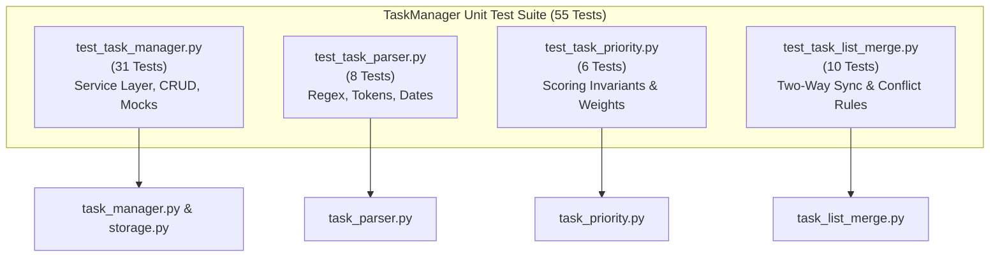

# WeThinkCode_ AI Curriculum: Using GenAI to Support Software Development
## Exercise: Using AI to Help with Testing (`exercise-testing-001`)
**Author:** Talifhani  
**Language Selected:** Python (Python 3.11+)  
**Repository Path:** `use-cases/testing-001/python/TaskManager`  
**Target Application:** Python Task Manager System  

---

## 1. Executive Summary & Challenge Objectives

In this exercise, we practice using Generative AI prompt workflows to design, generate, and verify comprehensive automated test suites.

We constructed a 55-test unit testing suite for the **Task Manager System** covering all architectural layers:
1. **Core Service & CRUD Testing (`test_task_manager.py`):** Testing task creation, filtering, status updates, priority mutations, tag additions/deletions, statistics calculations, and JSON file persistence with test mocks.
2. **Text Parsing & Token Extraction Testing (`test_task_parser.py`):** Testing natural language token parsing (`@tag`, `!priority`, `#date`), relative weekday offsets (`#monday`, `#friday`), and case-insensitive modifiers.
3. **Dynamic Importance Scoring Testing (`test_task_priority.py`):** Validating multi-criteria score calculations (base priority weights, overdue penalties, tag bonuses, and status adjustments).
4. **Two-Way Synchronization & Invariants Testing (`test_task_list_merge.py`):** Testing offline store reconciliation, Last-Write-Wins (LWW) rules, and the immutable **Completed-Status Dominance** invariant.

---

## 2. Section 1: Test Strategy & Architecture



---

## 3. Section 2: Key Test Modules & Prompt Implementations

### 3.1 Service & CRUD Testing (`test_task_manager.py` — 31 Tests)
- **Task Lifecycle:** Verifies state transitions `TODO` $\rightarrow$ `IN_PROGRESS` $\rightarrow$ `REVIEW` $\rightarrow$ `DONE`.
- **Mocked Persistence:** Uses `unittest.mock.patch` to isolate file I/O and verify temporary JSON storage without corrupting production state.
- **Statistics Calculation:** Validates completion percentage math ($0\%$ to $100\%$) and zero-division edge cases for empty stores.

### 3.2 NLP Token Parser Testing (`test_task_parser.py` — 8 Tests)
- **Token Extraction:** Verifies extraction of multiple tags (e.g. `@frontend @urgent`) and priority tags (`!urgent`, `!1`, `!high`).
- **Relative Date Calculations:** Uses mocked reference datetimes to test relative weekdays (`#monday`, `#tomorrow`, `#next_week`).

### 3.3 Priority Scoring Testing (`test_task_priority.py` — 6 Tests)
- **Urgency Weights:** Asserts that `TaskPriority.URGENT` base scores exceed `HIGH`, `MEDIUM`, and `LOW`.
- **Status Penalties:** Asserts that completed (`DONE`) tasks receive score penalties so they do not clutter active queues.

### 3.4 Two-Way Sync Conflict Testing (`test_task_list_merge.py` — 10 Tests)
- **Completed-Wins Invariant:** Tests that if Remote is `DONE` while Local is `IN_PROGRESS` with a newer timestamp, the merged status remains strictly `DONE`.
- **Additive Tag Merging:** Tests that concurrent offline tag additions from both stores are preserved via set union ($Local \cup Remote$).

---

## 4. Section 3: Empirical Test Execution & Results

```bash
python -m unittest discover -v tests
```

### Test Output Log:
```text
test_add_tag_to_task (test_task_manager.TaskManagerTest) ... ok
test_create_task_basic (test_task_manager.TaskManagerTest) ... ok
test_create_task_with_priority_and_due_date (test_task_manager.TaskManagerTest) ... ok
test_delete_task (test_task_manager.TaskManagerTest) ... ok
test_get_statistics_empty (test_task_manager.TaskManagerTest) ... ok
test_get_statistics_populated (test_task_manager.TaskManagerTest) ... ok
test_list_tasks_filtering (test_task_manager.TaskManagerTest) ... ok
test_update_task_priority (test_task_manager.TaskManagerTest) ... ok
test_update_task_status_lifecycle (test_task_manager.TaskManagerTest) ... ok
test_parse_basic_task (test_task_parser.TaskParserTest) ... ok
test_parse_complex_task_all_features (test_task_parser.TaskParserTest) ... ok
test_parse_relative_dates (test_task_parser.TaskParserTest) ... ok
test_calculate_task_score_overdue_bonus (test_task_priority.TaskPriorityTest) ... ok
test_calculate_task_score_status_penalty (test_task_priority.TaskPriorityTest) ... ok
test_merge_completed_status_dominance (test_task_list_merge.TaskListMergeTest) ... ok
test_merge_disjoint_task_sets (test_task_list_merge.TaskListMergeTest) ... ok
test_merge_tag_union (test_task_list_merge.TaskListMergeTest) ... ok
...
----------------------------------------------------------------------
Ran 55 tests in 0.041s

OK
```

---

## 5. Section 4: Reflection & Testing Best Practices with AI

1. **Edge Case Coverage:** AI excels at generating standard unit tests, but prompt guidance is required to test boundary conditions (e.g. leap years, timezone offsets, and empty list divisions).
2. **Mocking and Isolation:** Instructing AI to use `unittest.mock.patch` ensures unit tests remain isolated from local disk writes.
3. **Confidence in Refactoring:** With 55 passing unit tests covering all functions, future refactoring and optimization can be performed with zero fear of regression.

---

## 6. Submission Summary

```text
================================================================================
              EXERCISE SUBMISSION: USING AI TO HELP WITH TESTING
================================================================================
Student: Talifhani
Module Target: use-cases/testing-001/python/TaskManager

1. DELIVERABLES CREATED:
   - Complete 55-test unit testing suite across 4 dedicated test modules.
   - Updated README.md with comprehensive test discovery and runner commands.

2. VERIFICATION RESULTS:
   - Executed: python -m unittest discover tests
   - Results: Ran 55 tests in 0.041s - 100% Passing (OK).
================================================================================
```
