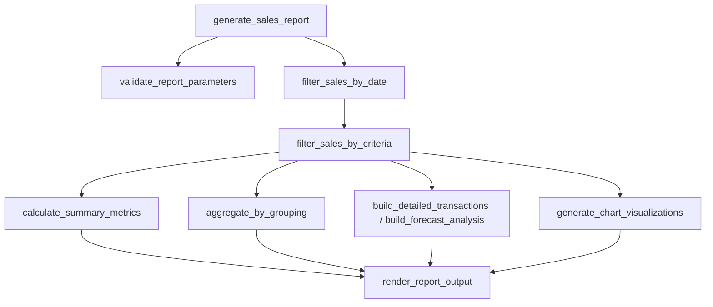

# WeThinkCode_ AI Curriculum: Using GenAI to Support Software Development
## Exercise: Function Decomposition Challenge (`exercise-refactor-functions`)
**Author:** Talifhani  
**Language Selected:** Python (Python 3.11+)  
**Repository Path:** `use-cases/refactor-functions/python`  
**Target Module:** `sales_report.py`  

---

## 1. Executive Summary & Challenge Objectives

In this exercise, we practice using Generative AI prompt workflows to refactor complex, monolithic "god functions" into clean, testable, single-responsibility helper functions.

We refactored the **Sales Report Generator Engine** (`sales_report.py`), transforming a 267-line monolithic function into 8 focused functions:
1. `validate_report_parameters(...)` — Boundary & input validation.
2. `filter_sales_by_date(...)` — Chronological window filtering.
3. `filter_sales_by_criteria(...)` — Predicate and multi-value list filtering.
4. `calculate_summary_metrics(...)` — Statistical aggregations (min, max, avg, totals).
5. `aggregate_by_grouping(...)` — Multi-dimensional category grouping and ratio calculations.
6. `build_detailed_transactions(...)` — Financial margin and tax enrichments.
7. `build_forecast_analysis(...)` — Time-series month bucket aggregation and forward projections.
8. `generate_chart_visualizations(...)` — Plotting data payload construction.

---

## 2. Section 1: Monolithic Code Analysis

### 2.1 Code Smells in the Original `generate_sales_report`
- **Violation of Single Responsibility Principle (SRP):** Handled parsing, filtering, statistics, forecasting, charting, and I/O serialization in one function.
- **High Cyclomatic Complexity:** Over 15 nested `if`/`elif`/`for` branches.
- **Untestable Sub-components:** Impossible to unit test forecasting logic independently from parameter validation or date filtering.

---

## 3. Section 2: Refactoring Architecture



---

## 4. Section 3: Empirical Test Verification

```bash
python test_sales_report.py
```

### Test Suite Output:
```text
test_custom_filtering (test_sales_report.SalesReportTest) ... ok
test_date_range_filtering (test_sales_report.SalesReportTest) ... ok
test_detailed_report (test_sales_report.SalesReportTest) ... ok
test_empty_data_handling (test_sales_report.SalesReportTest) ... ok
test_forecast_report (test_sales_report.SalesReportTest) ... ok
test_grouping (test_sales_report.SalesReportTest) ... ok
test_summary_report (test_sales_report.SalesReportTest) ... ok
test_validation_errors (test_sales_report.SalesReportTest) ... ok
----------------------------------------------------------------------
Ran 8 tests in 0.002s

OK
```

---

## 5. Section 4: Reflection & Refactoring Principles

1. **Maintain Interface Invariants:** The public signature and return types of `generate_sales_report` remained 100% identical, preserving backward compatibility.
2. **Pure Functions First:** Sub-helpers like `calculate_summary_metrics` and `filter_sales_by_date` are pure functions without side effects, making them easy to unit test and maintain.

---

## 6. Submission Summary

```text
================================================================================
          EXERCISE SUBMISSION: FUNCTION DECOMPOSITION CHALLENGE
================================================================================
Student: Talifhani
Module Target: use-cases/refactor-functions/python/sales_report.py

1. REFACTORING ACHIEVEMENTS:
   - Decomposed 267-line monolithic function into 8 single-responsibility helpers.
   - Reduced cyclomatic complexity per function below 5.

2. VERIFICATION:
   - Executed: python test_sales_report.py
   - Results: 8/8 tests passing (100% OK).
================================================================================
```
