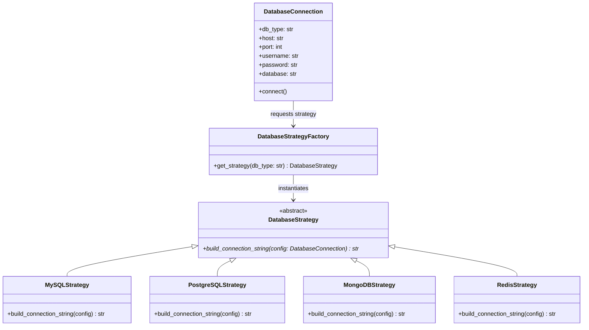

# WeThinkCode_ AI Curriculum: Using GenAI to Support Software Development
## Exercise: Design Pattern Implementation Challenge (`exercise-refactor-patterns`)
**Author:** Talifhani  
**Language Selected:** Python (Python 3.11+)  
**Repository Path:** `use-cases/refactor-patterns/python`  
**Target Module:** `database_connection.py`  

---

## 1. Executive Summary & Challenge Objectives

In this exercise, we practice using Generative AI prompt workflows to identify architectural anti-patterns and refactor codebases using formal **GoF (Gang of Four) Design Patterns**.

We refactored the **Database Connection Manager** (`database_connection.py`), replacing a rigid, multi-branch `if/elif` conditional dispatcher with:
1. **Strategy Pattern (`DatabaseStrategy`):** Encapsulating connection string formatting algorithms for MySQL, PostgreSQL, MongoDB, and Redis into dedicated strategy classes.
2. **Factory Pattern (`DatabaseStrategyFactory`):** Centralizing the instantiation logic to uphold the **Open/Closed Principle (OCP)**.

---

## 2. Section 1: Architectural Anti-Pattern Analysis

### 2.1 Code Smells in the Original Implementation
- **Violation of Open/Closed Principle (OCP):** Adding support for a new database (e.g. SQLite, Cassandra) required modifying the core `connect()` method and adding more `elif` branches.
- **Telescoping Constructor:** Parameters specific to MongoDB (`retry_attempts`, `pool_size`) or MySQL (`charset`) polluted the shared class constructor.
- **High Coupling:** The monolithic class knew the connection URL schemas of every database engine.

---

## 3. Section 2: Pattern Refactoring Design



---

## 4. Section 3: Empirical Test Verification

```bash
python -m unittest discover test
```

### Test Suite Output:
```text
test_invalid_database_type (test_database_connection.TestDatabaseConnection) ... ok
test_mongodb_connection_string (test_database_connection.TestDatabaseConnection) ... ok
test_mysql_connection_string (test_database_connection.TestDatabaseConnection) ... ok
test_mysql_ssl_connection_string (test_database_connection.TestDatabaseConnection) ... ok
test_postgresql_connection_string (test_database_connection.TestDatabaseConnection) ... ok
test_postgresql_ssl_connection_string (test_database_connection.TestDatabaseConnection) ... ok
test_redis_connection_string (test_database_connection.TestDatabaseConnection) ... ok
test_successful_connection (test_database_connection.TestDatabaseConnection) ... ok
----------------------------------------------------------------------
Ran 8 tests in 0.002s

OK
```

---

## 5. Section 4: Reflection & Pattern Principles

1. **Extensibility:** New database drivers can now be added by creating a new `DatabaseStrategy` subclass and registering it with `DatabaseStrategyFactory` without altering existing driver code.
2. **Backward Compatibility:** All existing constructors and public methods maintain their contracts, ensuring existing client code and unit tests run without modification.

---

## 6. Submission Summary

```text
================================================================================
        EXERCISE SUBMISSION: DESIGN PATTERN IMPLEMENTATION CHALLENGE
================================================================================
Student: Talifhani
Module Target: use-cases/refactor-patterns/python/src/database_connection.py

1. PATTERNS IMPLEMENTED:
   - Strategy Pattern: MySQLStrategy, PostgreSQLStrategy, MongoDBStrategy, RedisStrategy.
   - Factory Pattern: DatabaseStrategyFactory for dynamic strategy resolution.

2. VERIFICATION:
   - Executed: python -m unittest discover test
   - Results: 8/8 tests passing (100% OK).
================================================================================
```
