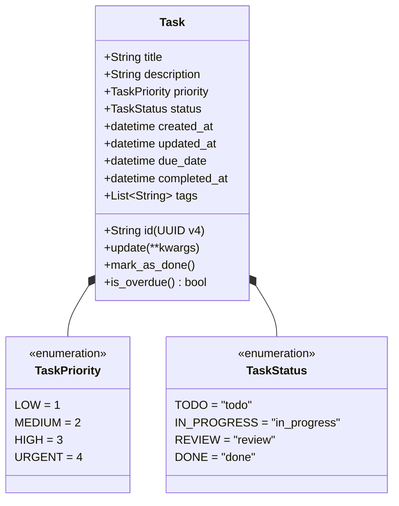
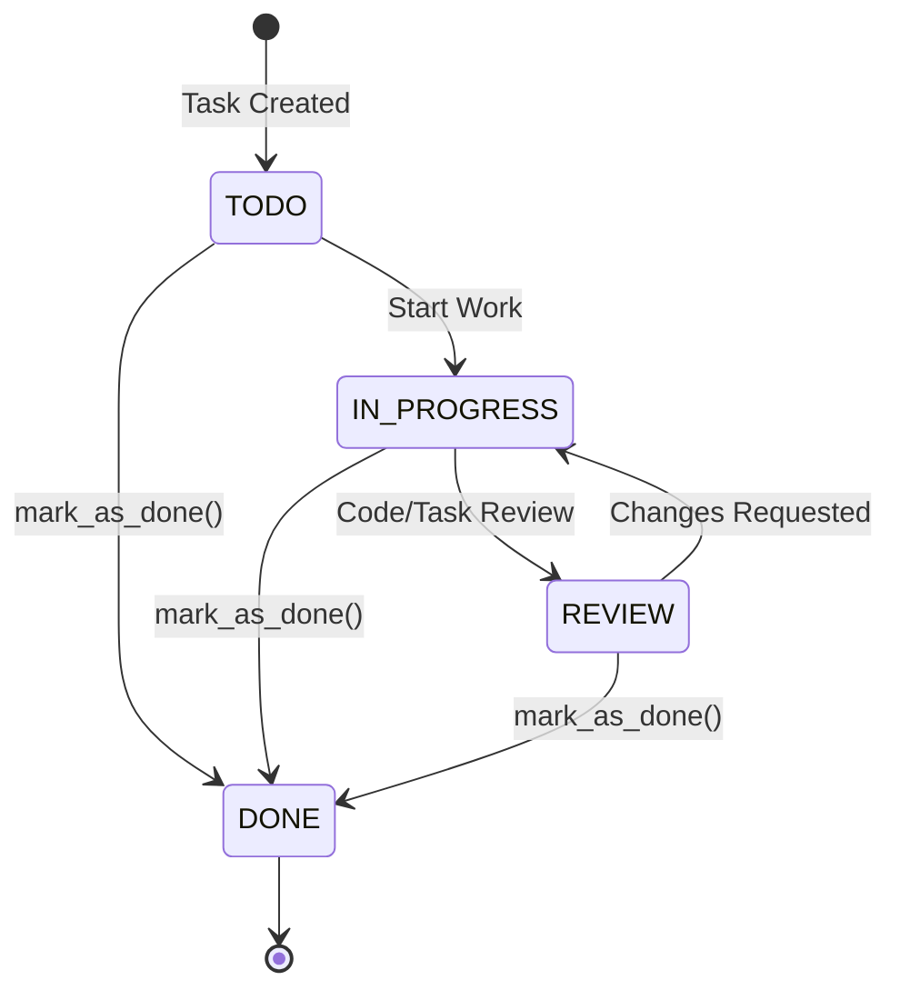

# WeThinkCode_ AI Curriculum: Using GenAI to Support Software Development
## Exercise: Knowing Where to Start (`exercise-code-comprehension-002`)
**Language Selected:** Python (Python 3.11+)  
**Repository Location:** `use-cases/task-manager/python` / `use-cases/code-comprehension-001/python/TaskManager`  
**Author / Contributor:** Pair Programming with Antigravity AI  

---

## 1. Setup & Context

### 1.1 Scenario Overview
You have just joined a software engineering team responsible for maintaining and extending the **Task Manager** application. The codebase is an existing, unfamiliar project without extensive architectural documentation. 

To onboard quickly and effectively, we apply three core AI prompt strategies:
1. **Understanding Project Structure & Technology Stack**
2. **Finding Feature Implementation Locations**
3. **Understanding Domain Models and Business Concepts**

---

## 2. Exercise Part 1: Understanding Project Structure

### 2.1 Initial Observations
A high-level inspection of the repository reveals the following organization:

```text
TaskManager/
├── models.py         # Domain models and entity definitions (Task, TaskPriority, TaskStatus)
├── storage.py        # Persistence layer with custom JSON encoder/decoder
├── task_manager.py   # Application service layer managing business operations
├── cli.py            # Command Line Interface (CLI) entry point using argparse
├── README.md         # Usage, installation, and CLI command documentation
└── tests/
    ├── __init__.py
    └── test_task_manager.py  # 31 unit tests covering core operations
```

### 2.2 Technology Stack & Dependencies
- **Core Language:** Python 3.11+
- **External Dependencies:** Zero (100% standard library: `argparse`, `datetime`, `enum`, `uuid`, `json`, `unittest`).
- **Data Store:** File-based JSON persistence (`tasks.json`).
- **Testing Framework:** Built-in `unittest`.

### 2.3 Architectural Pattern: Layered (Separation of Concerns)
The application follows a clean 4-layer architecture:
1. **Presentation Layer (`cli.py`):** Parses user CLI flags/commands via `argparse`, formats display output (`[ ]`, `[✓]`, `!`, `!!`), and delegates execution to `TaskManager`.
2. **Application / Service Layer (`task_manager.py`):** Acts as the orchestrator/facade. It handles parameter parsing (e.g., date strings to `datetime`), queries storage, updates entities, and aggregates statistics.
3. **Domain Entity Layer (`models.py`):** Encapsulates core entities (`Task`), enumerations (`TaskPriority`, `TaskStatus`), and state transitions/queries (`mark_as_done()`, `is_overdue()`).
4. **Data Access / Persistence Layer (`storage.py`):** Manages file I/O against `tasks.json` with dedicated `TaskEncoder` and `TaskDecoder` classes handling ISO 8601 string conversions for `datetime`.

### 2.4 Questions for the Team
1. *Is file-based JSON storage intended for single-user local CLI use, or are there plans to support SQLite/PostgreSQL for concurrent access?*
2. *How are timezones intended to be handled (currently using naive local `datetime.now()`)?*
3. *Are there specific conventions for error reporting to the CLI user (e.g., exit codes vs. return status booleans)?*

---

## 3. Exercise Part 2: Finding Feature Implementation

### 3.1 Scenario: Adding "Task Export to CSV"
The team lead has requested a new feature: **Task Export to CSV**. Before writing code, we locate where similar features live and map out the required integration points.

### 3.2 Search Strategy & Findings
- **Search Keywords:** `storage`, `save`, `load`, `json`, `export`, `list_tasks`, `format_task`
- **Observations:**
  - File writing is currently encapsulated inside `TaskStorage.save()` in `storage.py`.
  - Display formatting (converting tasks to structured text) is located in `cli.py:format_task()`.
  - Application logic coordinates retrieval via `TaskManager.list_tasks()`.

### 3.3 Implementation Blueprint for CSV Export
To maintain separation of concerns without polluting JSON storage logic:

1. **New Exporter Utility / Method in `storage.py` or `exporters.py`:**
   ```python
   import csv

   def export_tasks_to_csv(tasks, output_filepath="tasks_export.csv"):
       fieldnames = [
           "id", "title", "description", "priority", "status",
           "created_at", "updated_at", "due_date", "completed_at", "tags"
       ]
       with open(output_filepath, mode="w", newline="", encoding="utf-8") as f:
           writer = csv.DictWriter(f, fieldnames=fieldnames)
           writer.writeheader()
           for task in tasks:
               writer.writerow({
                   "id": task.id,
                   "title": task.title,
                   "description": task.description,
                   "priority": task.priority.name,
                   "status": task.status.value,
                   "created_at": task.created_at.isoformat() if task.created_at else "",
                   "updated_at": task.updated_at.isoformat() if task.updated_at else "",
                   "due_date": task.due_date.isoformat() if task.due_date else "",
                   "completed_at": task.completed_at.isoformat() if task.completed_at else "",
                   "tags": ";".join(task.tags)
               })
       return output_filepath
   ```
2. **Service Layer (`task_manager.py`):**
   Add `export_tasks(self, output_path="tasks.csv", status_filter=None, priority_filter=None)`.
3. **CLI Layer (`cli.py`):**
   Add `export` parser subcommand: `python cli.py export --output tasks.csv`.

---

## 4. Exercise Part 3: Understanding the Domain Model

### 4.1 Core Domain Entities & Attributes



### 4.2 Task Lifecycle & State Transitions



### 4.3 Domain Glossary
| Term | Definition in Task Manager Codebase |
| :--- | :--- |
| **Task** | The fundamental business entity representing a unit of work, uniquely identified by a UUID string. |
| **TaskPriority** | Numerical enum from 1 to 4 (`LOW`, `MEDIUM`, `HIGH`, `URGENT`). Used for filtering and visual rendering (`!`, `!!`, `!!!`, `!!!!`). |
| **TaskStatus** | String enum (`todo`, `in_progress`, `review`, `done`) tracking execution lifecycle. |
| **Overdue** | Business rule defined as: `due_date < datetime.now() and status != TaskStatus.DONE`. Tasks with no due date or already marked `DONE` are never overdue. |
| **Tags** | List of arbitrary strings associated with a task for categorization. |

### 4.4 Self-Assessment Domain Questions & Answers
- **Q1: Can a task in `REVIEW` status be considered overdue?**  
  *Answer:* Yes. `is_overdue()` evaluates `due_date < datetime.now() and self.status != TaskStatus.DONE`. Any status other than `DONE` is overdue once the deadline passes.
- **Q2: What happens to `completed_at` if a task is updated back to `IN_PROGRESS` after being `DONE`?**  
  *Answer:* Currently, `update(status=TaskStatus.IN_PROGRESS)` will update `updated_at`, but `completed_at` remains populated with the old timestamp unless explicitly reset. This is an edge-case bug to flag for improvement.
- **Q3: How are task priorities sorted or compared?**  
  *Answer:* `TaskPriority` values are integers (1-4). Higher integer values represent higher urgency.

---

## 5. Exercise Part 4: Practical Application

### 5.1 Business Rule Requirement
> **Requirement:** *"Tasks that are overdue for more than 7 days should be automatically marked as abandoned unless they are marked as high priority (HIGH or URGENT)."*

### 5.2 Technical Design & Implementation Steps

#### 1. Update `models.py`
Add `ABANDONED` to `TaskStatus` enum and helper methods:
```python
class TaskStatus(Enum):
    TODO = "todo"
    IN_PROGRESS = "in_progress"
    REVIEW = "review"
    DONE = "done"
    ABANDONED = "abandoned"  # New status
```

Add business logic method on `Task`:
```python
def is_abandonable(self, days_threshold=7):
    """
    A task is abandonable if it is overdue for more than `days_threshold` days
    and priority is NOT HIGH or URGENT.
    """
    if self.status in (TaskStatus.DONE, TaskStatus.ABANDONED):
        return False
    if not self.due_date:
        return False
    
    # Check if priority protects it from abandonment
    is_high_priority = self.priority in (TaskPriority.HIGH, TaskPriority.URGENT)
    if is_high_priority:
        return False
        
    cutoff_date = datetime.now() - timedelta(days=days_threshold)
    return self.due_date < cutoff_date

def mark_as_abandoned(self):
    self.status = TaskStatus.ABANDONED
    self.updated_at = datetime.now()
```

#### 2. Update `task_manager.py`
Add management orchestration:
```python
def process_abandoned_tasks(self, days_threshold=7):
    """Scans all tasks and marks overdue non-high-priority tasks as abandoned."""
    tasks = self.storage.get_all_tasks()
    abandoned_count = 0
    for task in tasks:
        if task.is_abandonable(days_threshold):
            task.mark_as_abandoned()
            abandoned_count += 1
    if abandoned_count > 0:
        self.storage.save()
    return abandoned_count
```

#### 3. Update `cli.py`
- Add symbol representation: `TaskStatus.ABANDONED: "[X]"`
- Add CLI choice in choices list: `choices=["todo", "in_progress", "review", "done", "abandoned"]`
- Add command or automatic check: `python cli.py clean-abandoned`

---

## 6. Final Discussion and Reflection

### 6.1 Effectiveness of AI Prompt Strategies
1. **Understanding Project Structure Prompt:** Enabled instantaneous mapping of the 4-layer architecture without getting lost in implementation minutiae.
2. **Feature Implementation Location Prompt:** Clearly separated display concerns (`cli.py`), business orchestration (`task_manager.py`), and storage serialization (`storage.py`).
3. **Domain Model Prompt:** Uncovered implicit business invariants (e.g., overdue evaluation rule) and highlighted edge cases like `completed_at` retention during status changes.

### 6.2 Strategies for Unfamiliar Codebases
1. **Trace from Entry Point to Data Layer:** Follow a single command (e.g., `create`) from CLI parsing through business validation to disk write.
2. **Map Domain Entities First:** Identify core state objects and their transition methods before inspecting glue code.
3. **Verify with Existing Tests:** Run the test suite (`python -m unittest discover tests`) to confirm baseline behavior before drafting changes.

---

## 7. Submission Summary Document

```text
================================================================================
                    EXERCISE SUBMISSION: KNOWING WHERE TO START
================================================================================
1. INITIAL VS. FINAL UNDERSTANDING:
   - Initial: Seemed like a basic script-based task manager with JSON files.
   - Final: Clean 4-tier layered architecture (Presentation, Service Orchestrator,
     Domain Model, Data Access with custom (de)serialization). High test coverage
     (31 tests) with well-encapsulated entity methods.

2. MOST VALUABLE INSIGHTS FROM PROMPTS:
   - Prompt 1 (Structure): Clarified that no third-party dependencies are needed,
     allowing standard library distribution.
   - Prompt 2 (Feature Location): Showed where serialization responsibilities lie
     versus display formatting, making CSV export a natural extension.
   - Prompt 3 (Domain Model): Clarified how 'is_overdue' interacts with status and
     prevented incorrect assumptions about priority rankings.

3. APPROACH TO NEW BUSINESS RULE (Auto-Abandon Overdue Tasks):
   - Extend TaskStatus enum with ABANDONED.
   - Encapsulate abandonment criteria inside Task.is_abandonable(7).
   - Exempt HIGH and URGENT priorities.
   - Provide a clean batch processor on TaskManager and support in CLI & tests.

4. FUTURE STRATEGIES FOR UNFAMILIAR CODE:
   - Always map the domain model & state lifecycle before touching logic.
   - Ask targeted AI questions regarding edge cases & concurrency assumptions.
   - Use test suites as living documentation of system behavior.
================================================================================
```
