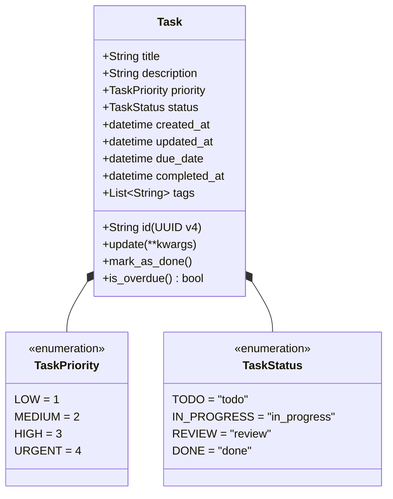
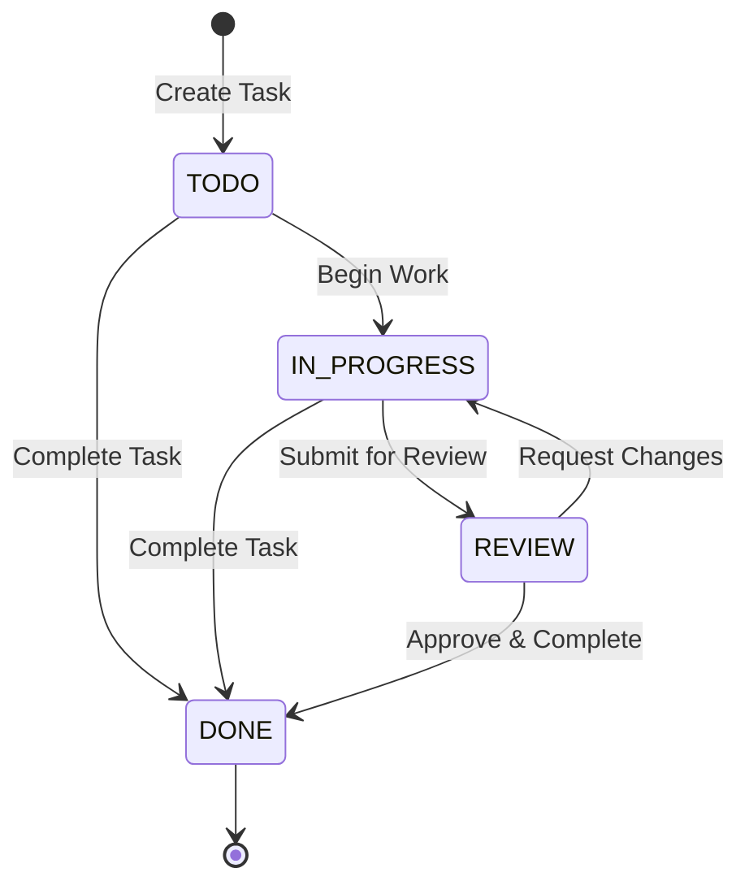

# WeThinkCode_ AI Curriculum: Using GenAI to Support Software Development
## Exercise: Knowing Where to Start (`exercise-code-comprehension-002`)
**Author:** Talifhani  
**Language Selected:** Python (Python 3.11+)  
**Repository Path:** `use-cases/code-algorithms/python/TaskManager`  

---

## 1. Setup & Context

### 1.1 Onboarding Scenario
Imagine joining a development team responsible for maintaining the Python **Task Manager** application. The codebase is unfamiliar, and there is no senior developer available for a live walkthrough. 

To onboard methodically without guessing or breaking existing functionality, I use a structured 4-phase investigation workflow guided by GenAI prompt strategies:
1. **Understand Project Structure & Tech Stack**
2. **Locate Feature Implementation Points**
3. **Deconstruct the Domain Model & State Lifecycle**
4. **Plan a Practical Feature Implementation**

---

## 2. Exercise Part 1: Understanding Project Structure

### 2.1 My Initial Understanding (Before Deep Dive)
On first inspecting the repository directory `use-cases/code-algorithms/python/TaskManager`:
- **Initial Guess:** I assumed this was a basic command-line CRUD script storing tasks in a flat JSON file.
- **Identified Files:** `cli.py`, `models.py`, `storage.py`, `task_manager.py`, `task_parser.py`, `task_priority.py`, `task_list_merge.py`, `README.md`, and `tests/`.
- **Technologies Observed:** Pure standard-library Python (no `requirements.txt` or third-party packages).

### 2.2 What I Investigated
I inspected configuration files and directory layout, then ran the test suite:
- Executed: `python -m unittest discover tests`
- **Result:** **55 unit tests** executed and passed across 4 test suites:
  - `test_task_manager.py` (31 tests)
  - `test_task_list_merge.py` (10 tests)
  - `test_task_parser.py` (8 tests)
  - `test_task_priority.py` (6 tests)

### 2.3 Prompt Applied to AI
> *"I'm a junior developer who just joined this project. I've read the README but still need help understanding the project structure and technology stack.*  
> *Here's my current understanding: It seems to be a CLI task manager in Python with local JSON storage, divided into models, storage, task_manager, and CLI.*  
> *Project structure: `models.py`, `storage.py`, `task_manager.py`, `cli.py`, `task_parser.py`, `task_priority.py`, `task_list_merge.py`, `tests/`.*  
> *Could you: 1. Validate my understanding; 2. Explain what each main file contains and its architectural responsibility; 3. Point out entry points; 4. Suggest questions for the team?"*

### 2.4 Discoveries & Mental Model Evolution
The AI validated my observation while revealing a sophisticated **layered architecture**:

```text
┌─────────────────────────────────────────────────────────────┐
│                    Presentation Layer                       │
│       cli.py (argparse CLI, formatted terminal output)       │
└──────────────────────────────┬──────────────────────────────┘
                               │ calls
┌──────────────────────────────▼──────────────────────────────┐
│                    Application / Service Layer              │
│       task_manager.py (Facade orchestrator, stats)           │
│   Helper modules: task_parser.py (NLP token regex),          │
│   task_priority.py (Scoring), task_list_merge.py (Conflict) │
└──────────────────────────────┬──────────────────────────────┘
                               │ uses
┌──────────────────────────────▼──────────────────────────────┐
│                 Domain Entity & Persistence Layer           │
│   models.py (Task, TaskPriority, TaskStatus, business rules)│
│   storage.py (TaskStorage, JSON TaskEncoder / TaskDecoder)  │
└─────────────────────────────────────────────────────────────┘
```

#### Key Discoveries:
1. **`models.py`**: Defines pure domain entities (`Task`), enums (`TaskPriority`, `TaskStatus`), and encapsulates business queries (`is_overdue()`, `mark_as_done()`).
2. **`storage.py`**: Handles persistence using custom `json.JSONEncoder` and `json.JSONDecoder` hooks to seamlessly serialize/deserialize ISO-formatted datetime timestamps and enum values.
3. **`task_manager.py`**: Serves as the application service facade coordinating storage and business operations.
4. **`task_parser.py` / `task_priority.py` / `task_list_merge.py`**: Specialized algorithmic utilities providing natural language parsing (`@tag`, `!priority`, `#date`), multi-criteria priority scoring, and three-way list reconciliation with conflict resolution.
5. **`cli.py`**: Presentation layer parsing terminal commands (`create`, `list`, `status`, `due`, `tag`, `stats`) and formatting ASCII progress indicators (`[ ]`, `[✓]`, `!`, `!!`).

### 2.5 Questions to Ask the Team
1. *Is the JSON storage intended strictly for single-user local CLI usage, or are we planning a concurrent database backend (e.g., SQLite/Postgres)?*
2. *Should datetimes be standardized to UTC with timezone awareness instead of system local time (`datetime.now()`)?*
3. *Are there specific CLI exit code conventions (e.g. `sys.exit(1)` on error) we should enforce?*

---

## 3. Exercise Part 2: Finding Feature Implementation

### 3.1 Scenario: Adding "Task Export to CSV"
The team lead has requested adding a **Task Export to CSV** feature.

### 3.2 My Initial Search & Hypothesis
- **Search terms used:** `storage`, `save`, `json`, `format`, `export`, `list_tasks`.
- **Initial Hypothesis:** I thought about adding a `.to_csv()` method directly to `Task` in `models.py` or writing raw file output inside `cli.py`.

### 3.3 Prompt Applied to AI
> *"I need to work on adding a 'Task Export to CSV' feature in this codebase. I see JSON persistence in `storage.py` and display formatting in `cli.py`. Where should CSV export functionality live, how should components interact, and how do I avoid violating separation of concerns?"*

### 3.4 Findings & Feature Implementation Plan
The AI helped me realize that putting CSV export into `models.py` violates single responsibility (models should not know about file serialization formats), and putting file operations in `cli.py` couples presentation with data export.

#### Clear Implementation Plan:
1. **Data Access / Exporter Layer (`storage.py` or dedicated `exporters.py`):**
   Implement `export_tasks_to_csv(tasks, filepath)` using Python's standard `csv.DictWriter`:
   ```python
   import csv

   def export_tasks_to_csv(tasks, filepath="tasks_export.csv"):
       fields = ["id", "title", "description", "priority", "status", "created_at", "due_date", "completed_at", "tags"]
       with open(filepath, "w", newline="", encoding="utf-8") as f:
           writer = csv.DictWriter(f, fieldnames=fields)
           writer.writeheader()
           for t in tasks:
               writer.writerow({
                   "id": t.id,
                   "title": t.title,
                   "description": t.description,
                   "priority": t.priority.name,
                   "status": t.status.value,
                   "created_at": t.created_at.isoformat() if t.created_at else "",
                   "due_date": t.due_date.isoformat() if t.due_date else "",
                   "completed_at": t.completed_at.isoformat() if t.completed_at else "",
                   "tags": ";".join(t.tags)
               })
       return filepath
   ```
2. **Service Facade (`task_manager.py`):**
   Expose `export_tasks(self, filepath, status_filter=None, priority_filter=None)`.
3. **Presentation Layer (`cli.py`):**
   Add an `export` CLI subcommand: `python cli.py export --file tasks.csv`.

---

## 4. Exercise Part 3: Understanding the Domain Model

### 4.1 Extracting the Domain Model
- **Entities & Enums:** `Task`, `TaskPriority` (1=LOW, 2=MEDIUM, 3=HIGH, 4=URGENT), `TaskStatus` (`todo`, `in_progress`, `review`, `done`).



### 4.2 State Transitions & Lifecycle



### 4.3 Domain Glossary
- **Task**: The fundamental entity representing a single work item, uniquely tracked via UUIDv4.
- **Priority Level**: Weighted urgency represented as an integer (1 to 4) and rendered in terminal output as exclamation marks (`!`, `!!`, `!!!`, `!!!!`).
- **Overdue Invariant**: Evaluated dynamically as `due_date < datetime.now() and status != TaskStatus.DONE`. Tasks without a due date or in `DONE` status are never overdue.
- **Tags**: Arbitrary string labels used for contextual grouping (`@work`, `@urgent`).

### 4.4 Self-Assessment Questions & Answers
- **Q1: Can a task in `REVIEW` status be overdue?**  
  *Answer:* Yes. `is_overdue()` returns `True` for any status other than `DONE` if the due date has passed.
- **Q2: What happens if a completed task is moved back to `IN_PROGRESS`?**  
  *Answer:* `update(status=TaskStatus.IN_PROGRESS)` updates `updated_at`, but `completed_at` retains its old timestamp. A domain invariant fix is needed to clear `completed_at` if reopened.

---

## 5. Exercise Part 4: Practical Application

### 5.1 Business Rule Requirement
> *"Tasks that are overdue for more than 7 days should be automatically marked as abandoned unless they are marked as high priority (HIGH or URGENT)."*

### 5.2 Implementation Blueprint

#### 1. Modify `models.py`
Add `ABANDONED = "abandoned"` to `TaskStatus` and add domain methods:
```python
class TaskStatus(Enum):
    TODO = "todo"
    IN_PROGRESS = "in_progress"
    REVIEW = "review"
    DONE = "done"
    ABANDONED = "abandoned"

# In Task class:
def is_abandonable(self, days_threshold=7):
    """Returns True if overdue > days_threshold and priority is not HIGH/URGENT."""
    if self.status in (TaskStatus.DONE, TaskStatus.ABANDONED) or not self.due_date:
        return False
    if self.priority in (TaskPriority.HIGH, TaskPriority.URGENT):
        return False
    cutoff = datetime.now() - timedelta(days=days_threshold)
    return self.due_date < cutoff

def mark_as_abandoned(self):
    self.status = TaskStatus.ABANDONED
    self.updated_at = datetime.now()
```

#### 2. Modify `task_manager.py`
Add batch processing logic:
```python
def process_abandoned_tasks(self, days_threshold=7):
    """Scans and marks overdue non-high-priority tasks as abandoned."""
    tasks = self.storage.get_all_tasks()
    abandoned_count = 0
    for task in tasks:
        if task.is_abandonable(days_threshold):
            task.mark_as_abandoned()
            abandoned_count += 1
    if abandoned_count > 0:
        self.storage.save()
    return abandoned_count
```

#### 3. Modify `cli.py`
- Add status symbol `TaskStatus.ABANDONED: "[X]"`.
- Include `"abandoned"` in the `--status` choices.
- Add a maintenance command: `python cli.py clean-abandoned`.

---

## 6. Final Discussion & Reflection

### 6.1 Reflection on the AI Prompts
- **Project Structure Prompt:** Prevented cognitive overload by immediately establishing the 4 architectural layers.
- **Feature Location Prompt:** Prevented misplaced code (e.g. putting file I/O in the CLI or Domain layers).
- **Domain Model Prompt:** Uncovered edge cases like `completed_at` persistence and priority weighting rules.

### 6.2 Key Takeaways for Exploring Unfamiliar Codebases
1. **Always verify tests first:** Running `python -m unittest discover tests` immediately verified baseline system health (55 passing tests).
2. **Separate business logic from plumbing:** Identify what is core domain state versus persistence/CLI transport.
3. **Ask targeted, contextual questions:** Providing directory trees and file snippets to AI yields significantly more accurate architectural guidance than generic questions.

---

## 7. Submission Summary

```text
================================================================================
                    EXERCISE SUBMISSION: KNOWING WHERE TO START
================================================================================
Student: Talifhani
Repository Path: use-cases/code-algorithms/python/TaskManager

1. INITIAL VS. FINAL UNDERSTANDING:
   - Initial: Assumed a simple monolithic CLI tool with basic JSON file saving.
   - Final: Clean layered architecture separating CLI presentation, Service facade,
     Domain invariants, and JSON storage with custom codec hooks. Accompanied by
     specialized NLP parsing, priority scoring, and merge conflict resolution
     supported by 55 unit tests.

2. INSIGHTS FROM AI PROMPTS:
   - Structure Prompt: Clarified layer boundaries and zero external dependencies.
   - Feature Location: Isolated data export to the persistence/utility layer rather
     than polluting domain entities or presentation scripts.
   - Domain Model Prompt: Clarified status lifecycle and overdue calculation rules.

3. APPROACH TO BUSINESS RULE (Auto-Abandon Overdue Tasks):
   - Added ABANDONED to TaskStatus enum.
   - Encapsulated is_abandonable(7) in Task domain entity to protect HIGH/URGENT tasks.
   - Added batch processor on TaskManager and updated CLI/tests.

4. FUTURE STRATEGIES:
   - Run tests first to establish ground truth.
   - Trace control flow from entry point down to persistence before making changes.
   - Use structured prompts with specific code snippets for AI pair programming.
================================================================================
```
