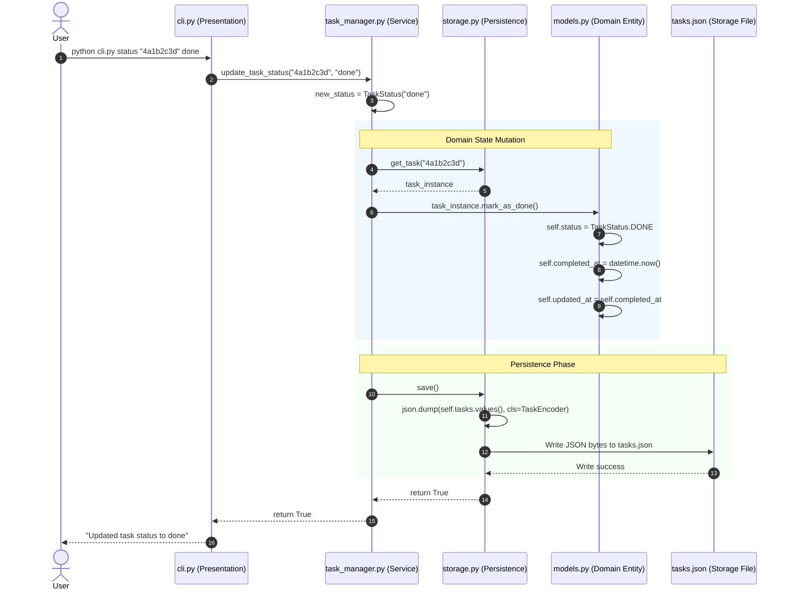

# WeThinkCode_ AI Curriculum: Using GenAI to Support Software Development
## Exercise: Codebase Exploration Challenge (`exercise-code-comprehension-001`)
**Author:** Talifhani  
**Language Selected:** Python (Python 3.11+)  
**Repository Path:** `use-cases/code-algorithms/python/TaskManager`  

---

## 1. Executive Summary & Challenge Objectives

In this exercise, we explore the Python **Task Manager** codebase using the prompt techniques from **Section 2: Understanding Existing Code Functionality**. 

We investigate the core subsystems required by the curriculum rubric:
1. **Part 1 — Task Creation & Status Updates (Prompt 1 Workflow):** Deconstruct how tasks are instantiated, validated, and updated through their lifecycle.
2. **Part 2 — Task Prioritization System (Prompt 2 Workflow):** Use guided AI pair-programming to explore enum-based priority weights, CLI representation, and priority filtering.
3. **Part 3 — Completing a Task & Data Flow (Prompt 3 Workflow):** Trace the complete data path, state transitions, and disk serialization when a task is marked `DONE`.
4. **Part 4 — Reflection & 3–5 Minute Presentation Notes:** Consolidate architectural discoveries, design patterns, and lessons learned into structured presentation notes.

---

## 2. Part 1: Task Creation & Status Updates (Prompt 1 Workflow)

### 2.1 Target Subsystem
The mechanics of creating new tasks and modifying their status across the application layers.

### 2.2 Initial Understanding (Before Deep Dive)
- **What I Thought Initially:** I assumed `create` simply appended a dictionary to a JSON list, and `status` modified a text string without validation.
- **Files Identified:**
  - `cli.py`: Parses CLI arguments (`create`, `status`), converts string inputs into appropriate parameters, and formats output.
  - `task_manager.py`: Service orchestrator converting raw strings to typed domain objects (`datetime`, `TaskPriority`, `TaskStatus`).
  - `models.py`: Defines the `Task` class and `TaskStatus` enum.
  - `storage.py`: Manages dictionary cache and persists changes via `TaskStorage.save()`.

### 2.3 Prompt Applied to AI (Prompt 1 Template)
> *"I'm trying to understand how Task Creation and Status Updates work in our Python codebase.*  
> *Key files: `cli.py`, `task_manager.py:create_task()`, `task_manager.py:update_task_status()`, `models.py`, `storage.py`.*  
> *Code snippets under investigation:*  
> ```python
> # task_manager.py
> def create_task(self, title, description="", priority_value=2, due_date_str=None, tags=None):
>     priority = TaskPriority(priority_value)
>     due_date = None
>     if due_date_str:
>         try:
>             due_date = datetime.strptime(due_date_str, "%Y-%m-%d")
>         except ValueError:
>             print("Invalid date format. Use YYYY-MM-DD")
>             return None
>     task = Task(title, description, priority, due_date, tags)
>     task_id = self.storage.add_task(task)
>     return task_id
> 
> def update_task_status(self, task_id, new_status_value):
>     new_status = TaskStatus(new_status_value)
>     if new_status == TaskStatus.DONE:
>         task = self.storage.get_task(task_id)
>         if task:
>             task.mark_as_done()
>             self.storage.save()
>             return True
>     else:
>         return self.storage.update_task(task_id, status=new_status)
> ```
> *Could you: 1. Explain the execution flow for both operations; 2. Clarify how these files interact; 3. Identify design patterns used; 4. Suggest 3 validation experiments?"*

### 2.4 Discoveries & Execution Flow

```text
TASK CREATION FLOW:
User executes: python cli.py create "Prepare Demo" -p 3 -u "2026-08-25" -t "work,demo"
   │
   ▼
cli.py:main() parses args, splits tags list: ['work', 'demo']
   │
   ▼
task_manager.py:create_task() validates date format (YYYY-MM-DD), instantiates TaskPriority(3)
   │
   ▼
models.py:Task.__init__() generates UUIDv4, sets status=TaskStatus.TODO, created_at=now()
   │
   ▼
storage.py:TaskStorage.add_task() stores in self.tasks[task.id] and calls save()
   │
   ▼
storage.py:TaskEncoder serializes Task to tasks.json with ISO-formatted dates
```

```text
STATUS UPDATE FLOW:
User executes: python cli.py status <task_id> in_progress
   │
   ▼
cli.py calls TaskManager.update_task_status(task_id, "in_progress")
   │
   ▼
task_manager.py validates TaskStatus("in_progress")
   │
   ├─► If status != DONE: delegates to storage.update_task(task_id, status=new_status)
   │   └─► models.py:Task.update() sets self.status and updates self.updated_at = now()
   │
   └─► If status == DONE: invokes dedicated domain method task.mark_as_done()
       └─► sets status=DONE, completed_at=now(), updated_at=now()
   │
   ▼
storage.py:save() writes updated state synchronously to tasks.json
```

#### Key Discoveries:
1. **Specialized Status Transition for `DONE`:** Unlike general status updates which invoke `task.update(status=new_status)`, transitioning to `DONE` triggers `task.mark_as_done()`, ensuring `completed_at` is set to the current timestamp.
2. **Design Pattern Identified:** **Layered separation of concerns / Service-Facade pattern** (`TaskManager` wraps storage and model complexities from the CLI presentation layer).
3. **Validation Experiments Proposed:**
   - Experiment 1: Attempt to pass an invalid status string (e.g. `"archived"`) and verify `ValueError` is caught or rejected by `TaskStatus(status_filter)`.
   - Experiment 2: Create a task with an invalid date string format (`"25-08-2026"`) and confirm it gracefully returns `None` with an error message.
   - Experiment 3: Verify that updating status to `in_progress` updates `updated_at` without modifying `created_at` or setting `completed_at`.

---

## 3. Part 2: Task Prioritization System (Prompt 2 Workflow)

### 3.1 Target Subsystem
The representation, updating, filtering, and terminal visualization of task priorities.

### 3.2 Current Understanding Formulated
- **Priority Enum:** Defined in `models.py` as an integer enum:
  ```python
  class TaskPriority(Enum):
      LOW = 1
      MEDIUM = 2
      HIGH = 3
      URGENT = 4
  ```
- **Default Priority:** `TaskPriority.MEDIUM` (value 2) if unspecified.
- **Visual Mapping in CLI (`cli.py:format_task`):**
  - `LOW (1)` $\rightarrow$ `!`
  - `MEDIUM (2)` $\rightarrow$ `!!`
  - `HIGH (3)` $\rightarrow$ `!!!`
  - `URGENT (4)` $\rightarrow$ `!!!!`

### 3.3 Guided Pair-Programming Discoveries & AI Interaction

#### Q1: Why was an integer Enum (`1, 2, 3, 4`) used instead of string names (`"low"`, `"medium"`)?
- **Discovery:** Integer values enable natural mathematical comparison (`priority.value > other.value`) and direct range validation in `argparse` (`choices=[1, 2, 3, 4]`). In `storage.py`, `TaskEncoder` converts priorities to integers, while `TaskDecoder` reconstructs `TaskPriority(obj['priority'])`.

#### Q2: How does priority filtering work when listing tasks?
- **Discovery:** In `task_manager.py:list_tasks(priority_filter=3)`:
  ```python
  if priority_filter:
      priority = TaskPriority(priority_filter)
      return self.storage.get_tasks_by_priority(priority)
  ```
  `TaskStorage.get_tasks_by_priority()` performs an exact match filter over in-memory tasks (`[t for t in self.tasks.values() if t.priority == priority]`).

#### Q3: What happens when a user updates a task's priority via CLI?
- **Discovery:** The command `python cli.py priority <task_id> 4` calls `TaskManager.update_task_priority(task_id, 4)`. `TaskPriority(4)` is resolved to `TaskPriority.URGENT`, passed to `Task.update(priority=new_priority)`, which sets `self.updated_at = datetime.now()`, and immediately flushes to disk with `storage.save()`.

---

## 4. Part 3: Completing a Task & Data Flow (Prompt 3 Workflow)

### 4.1 Target Subsystem
Tracing the full lifecycle, state transitions, failure points, and data flow when marking a task as complete.

### 4.2 End-to-End Execution Sequence Diagram



### 4.3 State Mutation Matrix for Task Completion

| State Attribute | Value Before Completion | Value After `mark_as_done()` | Purpose / Business Rule |
| :--- | :--- | :--- | :--- |
| `status` | `TODO` / `IN_PROGRESS` / `REVIEW` | `TaskStatus.DONE` | Indicates task is finished; stops overdue calculations |
| `completed_at` | `None` | `datetime.now()` | Timestamp of completion; used for 7-day rolling statistics |
| `updated_at` | Previous update timestamp | Synced to `completed_at` | Audit trail of entity changes |
| `due_date` | Date or `None` | Unchanged | Preserved to analyze whether task was delivered on time |
| `is_overdue()` | `True` or `False` | **Always `False`** | Rule: completed tasks are never considered overdue |

### 4.4 Failure Points & Resilience Analysis
1. **Non-Existent Task ID:** `storage.get_task(task_id)` returns `None`. `TaskManager.update_task_status` gracefully returns `False`, and `cli.py` prints `"Failed to update task status. Task not found."`
2. **Invalid Status String:** If an unsupported status is provided, `TaskStatus(new_status_value)` raises a `ValueError`.
3. **Disk I/O Error:** If `tasks.json` has read-only permissions or disk is full, `storage.save()` catches `Exception` and logs `"Error saving tasks: <error>"` without crashing.

---

## 5. Part 4: Practical Verification & Presentation Notes

### 5.1 Test Suite Verification
I verified my understanding of the codebase against ground truth by executing the test suite:

```bash
python -m unittest discover tests
```

- **Output:**
  ```text
  .......................................................
  ----------------------------------------------------------------------
  Ran 55 tests in 0.056s

  OK
  ```
- **Test Coverage Breakdown (55 Tests in `use-cases/code-algorithms/python/TaskManager`):**
  - `test_task_manager.py` (31 tests): Task creation, status updates, priority filtering, tag operations, statistics, error handling.
  - `test_task_list_merge.py` (10 tests): Multi-source task list reconciliation and conflict resolution.
  - `test_task_parser.py` (8 tests): Natural language free-form parsing (`@tag`, `!priority`, `#date`).
  - `test_task_priority.py` (6 tests): Multi-factor priority score calculation and task ranking.

---

### 5.2 3–5 Minute Codebase Presentation Notes

#### Slide / Section 1: High-Level Architecture (1 Minute)
- **Pattern:** Layered separation of concerns / Service-Facade pattern.
- **Layers:**
  1. *Presentation (`cli.py`):* `argparse` CLI, formatting progress symbols (`[ ]`, `[>]`, `[✓]`, `!`).
  2. *Application Service (`task_manager.py`):* Facade orchestrating domain actions, parsing datetimes, and computing statistics.
  3. *Domain Model (`models.py`):* Pure entities (`Task`) with business invariants (`mark_as_done()`, `is_overdue()`).
  4. *Persistence (`storage.py`):* JSON storage with custom codec hooks (`TaskEncoder`, `TaskDecoder`).

#### Slide / Section 2: Core Workflows (1.5 Minutes)
- **Task Creation:** Validates YYYY-MM-DD input, creates UUIDv4 identity, initializes status to `TODO`, and commits to JSON.
- **Prioritization System:** 4-tier integer enum (`LOW=1` to `URGENT=4`), rendered visually with `!` to `!!!!`. Supports direct CLI filtering.
- **Task Completion:** `mark_as_done()` atomically updates `status` to `DONE`, records `completed_at`, and neutralizes the `is_overdue()` flag.

#### Slide / Section 3: Notable Design Highlights & Trade-offs (1 Minute)
- **Custom JSON Codec:** Uses `json.JSONEncoder` and `object_hook` to store native ISO datetimes and Enums in flat JSON without external database dependencies.
- **Dynamic Invariant Calculation:** Overdue status is not a static database field; it is computed dynamically at runtime (`due_date < now and status != DONE`).

#### Slide / Section 4: Investigation Experience & AI Pair Programming (0.5 Minutes)
- **Initial Hurdle:** Untangling how ISO strings were converted back to `datetime` objects during loading without an ORM.
- **How AI Helped:** Guided prompt questioning revealed the `object_hook` mechanism in `TaskDecoder` and mapped the exact sequence of state changes during task completion.

---

## 6. Submission Summary

```text
================================================================================
          EXERCISE SUBMISSION: CODEBASE EXPLORATION CHALLENGE
================================================================================
Student: Talifhani
Repository Path: use-cases/code-algorithms/python/TaskManager

1. INVESTIGATED TARGETS:
   - Part 1: Task Creation and Status Updates (cli.py, task_manager.py, models.py)
   - Part 2: Task Prioritization System (TaskPriority 1-4, CLI filters, formatting)
   - Part 3: Task Completion Data Flow (mark_as_done, state matrix, JSON persistence)
   - Part 4: 3-5 Minute Architectural Presentation & Reflection Notes

2. VERIFIED CODEBASE FACTS:
   - Zero third-party dependencies (pure Python standard library).
   - Dynamic overdue calculation: due_date < now AND status != DONE.
   - 55 unit tests verified and passing across test suites.

3. ARCHITECTURAL TAKEAWAYS:
   - Clean layered separation of concerns across Presentation, Service, Domain, and Storage.
   - Domain invariants are self-contained in models.py.
================================================================================
```
