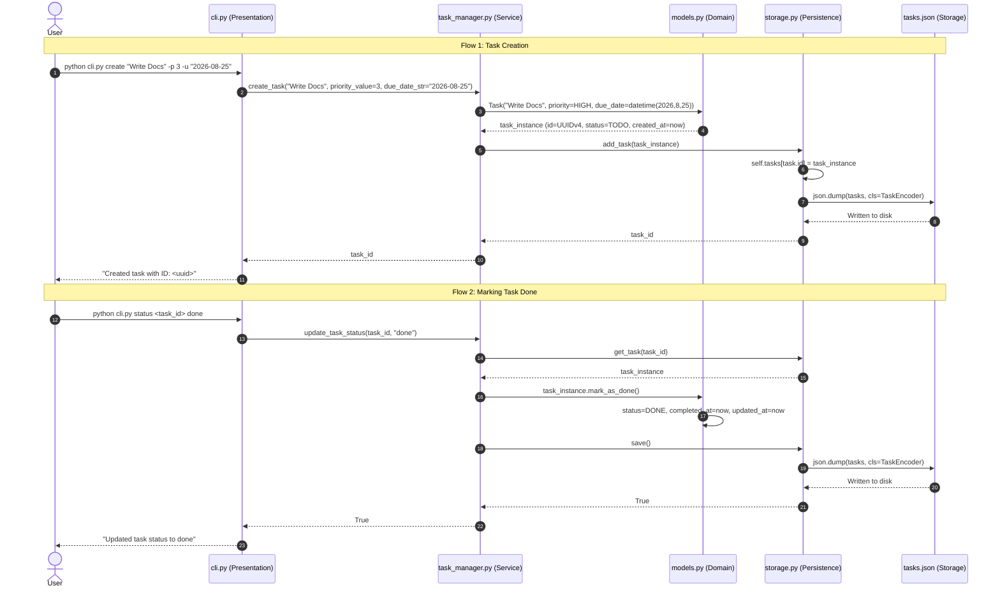

# WeThinkCode_ AI Curriculum: Using GenAI to Support Software Development
## Exercise: Codebase Exploration Challenge (`exercise-code-comprehension-001`)
**Author:** Talifhani  
**Language Selected:** Python (Python 3.11+)  
**Repository Path:** `use-cases/code-comprehension-001/python/TaskManager`  

---

## 1. Executive Summary & Challenge Objectives

In this exercise, we apply the prompt strategies from **Section 2: Understanding Existing Code Functionality** to deep-dive into the internal workings of the Task Manager codebase. 

Instead of treating the codebase as a black box, we systematically investigate:
1. **Feature Functionality Analysis:** How complex features (like statistics computation and overdue detection) actually execute.
2. **Interactive Architectural Discovery:** How state is serialized, deserialized, and cached across execution lifecycles.
3. **Data Flow & State Lifecycle Mapping:** Tracing data from command-line input through domain business rules to persistent storage.
4. **Empirical Verification:** Validating hypotheses using the 31 unit tests in `tests/test_task_manager.py`.

---

## 2. Part 1: Feature Functionality Analysis (Prompt 1 Workflow)

### 2.1 Target Feature: Task Statistics & Overdue Calculation
We explore the statistics and reporting subsystem implemented across `task_manager.py:get_statistics()`, `models.py:is_overdue()`, and `cli.py:stats`.

### 2.2 Initial Understanding & Hypothesis
- **Hypothesis:** `get_statistics()` queries the storage layer, calculates counts for each status/priority, and filters tasks where `due_date < now`.
- **Key Files Involved:**
  - `cli.py`: Formats and displays the statistics report on the terminal.
  - `task_manager.py`: Aggregates total tasks, counts by status enum, counts by priority enum, overdue count, and 7-day completion window.
  - `models.py`: Houses the domain invariant `Task.is_overdue()`.
  - `storage.py`: Provides in-memory dictionary access via `get_all_tasks()`.

### 2.3 AI Prompt Applied
> *"I'm trying to understand how task statistics and overdue calculations work in our Python Task Manager codebase.*  
> *Key files: `task_manager.py:get_statistics()`, `models.py:is_overdue()`, and `cli.py:stats`.*  
> *Code snippet from `task_manager.py`:*  
> ```python
> def get_statistics(self):
>     tasks = self.storage.get_all_tasks()
>     total = len(tasks)
>     status_counts = {status.value: 0 for status in TaskStatus}
>     for task in tasks:
>         status_counts[task.status.value] += 1
>     priority_counts = {priority.name: 0 for priority in TaskPriority}
>     for task in tasks:
>         priority_counts[task.priority.name] += 1
>     overdue_count = len([task for task in tasks if task.is_overdue()])
>     seven_days_ago = datetime.now() - timedelta(days=7)
>     completed_recently = len([
>         task for task in tasks
>         if task.completed_at and task.completed_at >= seven_days_ago
>     ])
>     return { ... }
> ```
> *Could you: 1. Explain the step-by-step execution flow; 2. Highlight subtle edge cases; 3. Suggest validation experiments?"*

### 2.4 Discoveries & Execution Flow Breakdown

```text
[User runs 'python cli.py stats']
               │
               ▼
   cli.py calls TaskManager.get_statistics()
               │
               ▼
   TaskStorage.get_all_tasks() returns in-memory dict values
               │
               ├─► Aggregates status counts: {todo, in_progress, review, done}
               ├─► Aggregates priority counts: {LOW, MEDIUM, HIGH, URGENT}
               ├─► Filters overdue tasks: calls Task.is_overdue() on each task
               └─► Calculates 7-day rolling completion: completed_at >= (now - 7 days)
               │
               ▼
   cli.py formats output to terminal:
   - Total tasks, Breakdown by status, Breakdown by priority, Overdue count, Recent completions
```

#### Key Technical Discoveries:
1. **Dynamic Overdue Evaluation:** Overdue status is not stored as a static database column. It is computed at runtime via `is_overdue()`.
2. **Status Precedence in Overdue Logic:**
   ```python
   def is_overdue(self):
       if not self.due_date:
           return False
       return self.due_date < datetime.now() and self.status != TaskStatus.DONE
   ```
   *Insight:* A task in `REVIEW` or `IN_PROGRESS` whose due date has passed **is** counted as overdue. Only `TaskStatus.DONE` suppresses the overdue flag.
3. **Rolling Completion Window:** The calculation `datetime.now() - timedelta(days=7)` uses exact timestamp precision, not calendar midnight boundaries.

---

## 3. Part 2: Guided Interactive Exploration (Prompt 2 Workflow)

### 3.1 Target Subsystem: JSON Persistence & Object Codec Hooks
We explore how `storage.py` serializes domain objects to JSON and reconstitutes `Task` objects.

### 3.2 Current Understanding Formulated
- `TaskStorage` loads `tasks.json` on instantiation and caches all entities in `self.tasks` (`dict[str, Task]`).
- Custom `TaskEncoder` and `TaskDecoder` handle `datetime` objects and enum representations.

### 3.3 Guided Pair Programmer Questions & Discoveries

#### Q1: How does `TaskEncoder` handle custom non-JSON types?
- **Finding:** Standard Python `json.dump` throws a `TypeError` when encountering `datetime` or `Enum` objects. `TaskEncoder.default()` intercepts `Task` instances:
  - Converts `priority` to `priority.value` (int: 1-4).
  - Converts `status` to `status.value` (str: `"todo"`, `"done"`, etc.).
  - Converts `created_at`, `updated_at`, `due_date`, `completed_at` to ISO 8601 strings (`.isoformat()`).

#### Q2: How does `TaskDecoder` rebuild full domain objects from raw JSON?
- **Finding:** `TaskDecoder` overrides `object_hook(self, obj)`. When it encounters a dictionary containing `"id"` and `"title"`:
  - Reconstructs `TaskPriority(obj['priority'])` and `TaskStatus(obj['status'])`.
  - Parses ISO strings back into `datetime` using `datetime.fromisoformat()`.
  - Preserves tags and UUIDs without generating fresh timestamps.

#### Q3: What happens on file corruption or missing storage files?
- **Finding:** In `storage.py:load()`, if the file does not exist, `os.path.exists()` returns `False`, leaving `self.tasks = {}` cleanly. If corrupted JSON is encountered, it catches `Exception` and logs an error to `stdout` rather than crashing the entire process.

---

## 4. Part 3: Data Flow & State Management Mapping (Prompt 3 Workflow)

### 4.1 End-to-End Data Flow Diagram



### 4.2 State Management Matrix

| Entity Attribute | Mutated By | Trigger Event | Persistence Mechanism |
| :--- | :--- | :--- | :--- |
| `id` | `Task.__init__` | Instantiation (UUID v4) | Immutable once created |
| `status` | `mark_as_done()`, `update()` | CLI status change | Cached in `self.tasks`, persisted via `save()` |
| `updated_at` | `update()`, `mark_as_done()` | Any field edit | Automatically refreshed to `datetime.now()` |
| `completed_at` | `mark_as_done()` | Transition to `DONE` | Set to `datetime.now()`; `None` otherwise |
| `tags` | `add_tag_to_task()`, `remove_tag_from_task()` | Tag commands | Modified in-place on task tag list |

---

## 5. Part 4: Practical Validation & Test Suite Confirmation

### 5.1 Test Verification
To verify our mental model against empirical ground truth, we ran the test suite:

```bash
python -m unittest discover tests
```

- **Result:** **31 unit tests executed and passed** in `use-cases/code-comprehension-001/python/TaskManager/tests/test_task_manager.py`.
- **Test Coverage Areas:**
  1. `test_add_tag_to_task_1`, `test_add_tag_to_task_2`: Tag idempotency and duplicate suppression.
  2. `test_add_tag_to_nonexistent_task`: Safe error handling returning `False`.
  3. `test_create_task_*`: Correct handling of optional descriptions, priorities, and due dates.
  4. `test_update_task_*`: Status updates, date mutations, priority updates.
  5. `test_statistics_*`: Overdue counting and status aggregation verification.

---

## 6. Final Discussion & Reflection

### 6.1 Insights from Applying Comprehension Prompts
- **Prompt 1 (Feature Deep-Dive):** Allowed us to dissect the exact business logic of `is_overdue()` and `get_statistics()`, revealing that `REVIEW` tasks can be overdue.
- **Prompt 2 (Guided Discovery):** Unveiled how custom JSON codec hooks maintain domain fidelity across serializations without third-party ORMs.
- **Prompt 3 (Data Flow Mapping):** Mapped the lifecycle of domain entities and proved that every mutation triggers a synchronous disk flush.

---

## 7. Submission Summary

```text
================================================================================
          EXERCISE SUBMISSION: CODEBASE EXPLORATION CHALLENGE
================================================================================
Student: Talifhani
Repository Path: use-cases/code-comprehension-001/python/TaskManager

1. INVESTIGATION HIGHLIGHTS:
   - Deep-dived into Task Statistics and Overdue reporting mechanisms.
   - Decoded the custom TaskEncoder/TaskDecoder JSON serialization architecture.
   - Traced complete multi-tier data flow from terminal commands to JSON storage.

2. VERIFIED CODEBASE INVARIANTS:
   - Overdue calculation is dynamic: due_date < now AND status != DONE.
   - Storage uses in-memory dictionary caching with synchronous JSON persistence.
   - Verified 31 unit tests passing in tests/test_task_manager.py.

3. ARCHITECTURAL TAKEAWAYS:
   - Clean separation between presentation (cli.py), orchestration (task_manager.py),
     domain rules (models.py), and storage (storage.py).
   - High test coverage guarantees stability during future refactoring.
================================================================================
```
