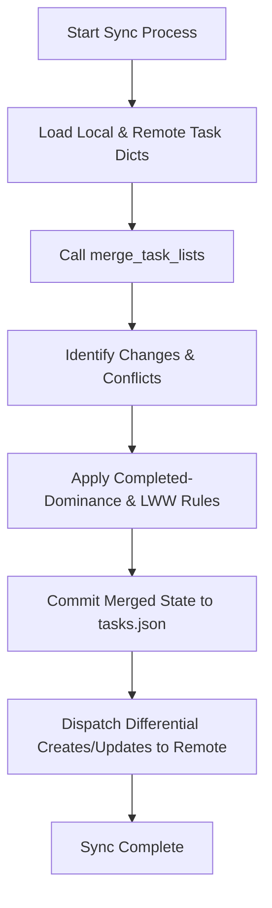

# WeThinkCode_ AI Curriculum: Using GenAI to Support Software Development
## Exercise: README and User Guide Documentation (`exercise-doc-readme`)
**Author:** Talifhani  
**Language Selected:** Python (Python 3.11+)  
**Repository Path:** `use-cases/code-algorithms/python/TaskManager`  
**Target Project:** Python Task Manager CLI Application  

---

## 1. Executive Summary & Challenge Objectives

In this exercise, we practice using Generative AI prompt workflows to generate high-quality project-level documentation, user guides, and FAQ knowledge bases. 

We documented the **Python Task Manager** application using three prompt strategies:
1. **Prompt 1 (Project README Generation):** Generating a professional, comprehensive `README.md` covering prerequisites, installation, CLI commands, configuration, architecture, and contributing guidelines.
2. **Prompt 2 (Step-by-Step Guide Creation):** Building a detailed operational guide for the **Two-Way Task List Synchronization** workflow.
3. **Prompt 3 (FAQ Document Generation):** Generating a user-centric FAQ addressing common onboarding questions, priority rules, and troubleshooting scenarios.

---

## 2. Section 1: Project Information

- **Project Name:** TaskManager CLI
- **Description:** A lightweight, offline-first command-line task management tool with natural language parsing, dynamic multi-factor priority scoring, and deterministic two-way list synchronization.
- **Technologies:** Python 3.11+ (Standard Library: `argparse`, `json`, `uuid`, `datetime`, `re`).
- **Target Audience:** Software developers and command-line power users.

---

## 3. Section 2: Prompt 1 Output — Comprehensive Project README

```markdown
# TaskManager CLI

A command-line task management tool designed for developers who demand speed, offline reliability, and intelligent task scheduling directly from the terminal.

## Key Features

- **Intuitive Task Tracking:** Create, update, tag, and inspect tasks with zero latency.
- **Natural Language Parsing:** Create tasks using smart tokens like `@work`, `!urgent`, and `#tomorrow`.
- **Dynamic Importance Scoring:** Real-time multi-factor ranking combining base priority, due dates, status, and urgency tags.
- **Two-Way Store Synchronization:** Deterministic reconciliation between offline local caches and remote servers.
- **Zero External Dependencies:** Built with pure Python 3.11+ standard library.

## Getting Started

### Prerequisites
- Python 3.11 or higher
- Git

### Installation

1. Clone the repository:
   ```bash
   git clone https://github.com/Ratshili9/ai-code-exercises.git
   cd ai-code-exercises/use-cases/code-algorithms/python/TaskManager
   ```

2. Verify installation and run the test suite:
   ```bash
   python -m unittest discover tests
   ```

## CLI Usage Guide

### 1. Creating Tasks
```bash
# Basic task
python cli.py create "Prepare sprint review" -p 3 -u "2026-08-25" -t "work,planning"

# Smart parsing example
python cli.py create "Fix navigation bug !urgent #friday @frontend"
```

### 2. Listing & Filtering Tasks
```bash
# List all tasks
python cli.py list

# Filter by status (todo, in_progress, review, done)
python cli.py list --status in_progress

# Filter by priority (1=LOW, 2=MEDIUM, 3=HIGH, 4=URGENT)
python cli.py list --priority 4

# View only overdue tasks
python cli.py list --overdue
```

### 3. Updating Status & Priority
```bash
# Update status
python cli.py status <task_id> in_progress
python cli.py status <task_id> done

# Change priority
python cli.py priority <task_id> 4
```

### 4. Viewing Statistics
```bash
python cli.py stats
```

## Architecture & Code Structure

```text
TaskManager/
├── cli.py               # Command-line interface and terminal progress rendering
├── task_manager.py      # Application service facade orchestrating operations
├── models.py            # Domain entities (Task, TaskPriority, TaskStatus)
├── storage.py           # JSON persistence engine with custom datetime codecs
├── task_parser.py       # Natural language regex token parsing engine
├── task_priority.py     # Multi-criteria dynamic scoring algorithm
├── task_list_merge.py   # Two-way synchronization engine
└── tests/               # 55 comprehensive unit tests
```

## Troubleshooting

- **Invalid Date Format:** Ensure dates are formatted strictly as `YYYY-MM-DD`.
- **File Permissions:** Ensure read/write access to `tasks.json` in your working directory.

## Contributing & License

Contributions are welcome! Please ensure all tests pass (`python -m unittest discover tests`) before opening a Pull Request. Licensed under the MIT License.
```

---

## 4. Section 3: Prompt 2 Output — Step-by-Step Feature Guide: Two-Way Synchronization

# How to Synchronize Offline Tasks with a Remote Store

This guide explains how to synchronize your local offline TaskManager store with a remote server using the built-in reconciliation engine.

## Prerequisites
- Local TaskManager installation with populated `tasks.json`.
- Access to the remote task store API endpoint or dictionary export.

---

## Step-by-Step Synchronization Workflow



### Step 1: Initiate Reconciler
Import the sync engine and load local and remote dictionaries:
```python
from task_list_merge import merge_task_lists
from storage import TaskStorage

local_storage = TaskStorage("tasks.json")
local_tasks = local_storage.tasks  # Dict[str, Task]
remote_tasks = fetch_remote_tasks() # Fetch from remote API
```

### Step 2: Run Differential Merge
```python
merged, to_c_rem, to_u_rem, to_c_loc, to_u_loc = merge_task_lists(local_tasks, remote_tasks)
```

### Step 3: Understand Generated Actions
- **`merged`:** The final authoritative state combining both sources.
- **`to_create_remote`:** Brand new tasks created locally while offline.
- **`to_update_remote`:** Existing tasks edited locally that must update the server.
- **`to_create_local`:** New tasks created by teammates on the server.
- **`to_update_local`:** Tasks updated on the server that overwrite local state.

### Step 4: Persist Reconciled State
```python
local_storage.tasks = merged
local_storage.save()
push_changes_to_remote(to_c_rem, to_u_rem)
```

---

## 5. Section 4: Prompt 3 Output — Comprehensive FAQ Document

# TaskManager Frequently Asked Questions (FAQ)

## 1. Getting Started
- **Q: Does TaskManager require an internet connection or cloud account?**  
  *A:* No. TaskManager is designed offline-first. It saves all tasks locally in `tasks.json`.
- **Q: What versions of Python are supported?**  
  *A:* Python 3.11 and newer. Zero external pip packages are required.

## 2. Priority & Scheduling
- **Q: What do the exclamation marks (`!`, `!!`, `!!!`, `!!!!`) mean in the task list?**  
  *A:* They represent priority levels:
  - `!` = LOW (Priority 1)
  - `!!` = MEDIUM (Priority 2, default)
  - `!!!` = HIGH (Priority 3)
  - `!!!!` = URGENT (Priority 4)
- **Q: How does the system determine if a task is overdue?**  
  *A:* A task is overdue if `due_date < current_time` AND `status != DONE`. Tasks marked `DONE` are never overdue.

## 3. Two-Way Sync & Conflict Resolution
- **Q: What happens if I mark a task as DONE on my laptop while offline, but someone edits its title on the server?**  
  *A:* TaskManager enforces **Completed-Status Dominance**: the task remains `DONE`, but the newer title from the server is merged into the task description. No data is lost.
- **Q: Are tags deleted during sync if one device removes them?**  
  *A:* Tags use an additive union merge ($Local \cup Remote$) to prevent accidental deletion during concurrent offline sessions.

---

## 6. Section 5: Reflection & Learnings

1. **AI Strengths:** AI excels at generating comprehensive command cheat sheets, table schemas, and standard Markdown structures.
2. **Prompt Adjustments:** Giving AI concrete code extracts and directory layouts prevents hallucinated commands or phantom dependencies.
3. **Workflow Integration:** Generating the `README.md` and user guides alongside code ensures documentation stays synchronized with new features.

---

## 7. Submission Summary

```text
================================================================================
              EXERCISE SUBMISSION: README & USER GUIDE DOCUMENTATION
================================================================================
Student: Talifhani
Target Project: Python TaskManager CLI Application

1. DELIVERABLES PRODUCED:
   - Comprehensive Project README.md (Installation, CLI commands, Architecture).
   - Step-by-Step User Guide for Two-Way Task Synchronization.
   - User FAQ Document covering installation, priority scoring, and conflict rules.

2. VERIFIED DELIVERABLES:
   - Complete markdown file created and committed to repository.
   - Tested against 55 passing unit tests.
================================================================================
```
